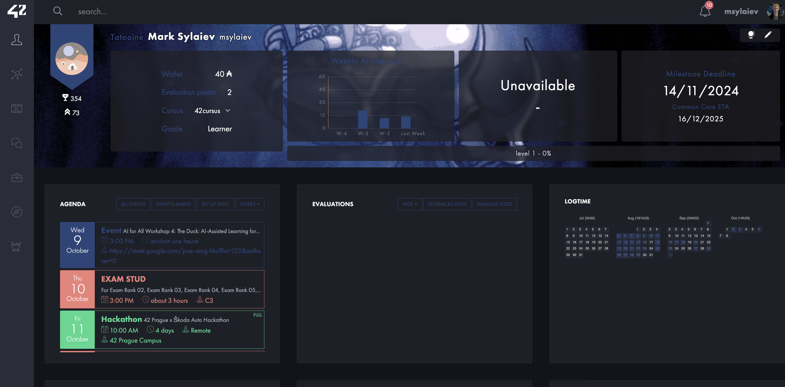

# Intra 42 Themes

## How to use

1. Install the Improved Intra 42 browser extension: [Chrome](https://chromewebstore.google.com/detail/improved-intra-42/hmflgigeigiejaogcgamkecmlibcpdgo?hl=en-GB&utm_source=ext_sidebar)

2. Install the Stylus browser extension: [Chrome](https://chrome.google.com/webstore/detail/stylus/clngdbkpkpeebahjckkjfobafhncgmne?hl=en)

3. Click a theme install link below

4. The stylus extension should open up with a button to install the style.

## Style Themes

### Hollow Knight

> background image is gif

[Install](https://github.com/theMark001/intra42-themes/raw/refs/heads/main/hollow_knight.user.css)

### Inventor

> background image is gif

[Install](https://github.com/theMark001/intra42-themes/raw/refs/heads/main/inventor.user.css)

### Star

> background image is gif

[Install](https://github.com/theMark001/intra42-themes/raw/refs/heads/main/star.user.css)

### Your Name

> background image is gif

[Install](https://github.com/theMark001/intra42-themes/raw/refs/heads/main/your_name.user.css)

